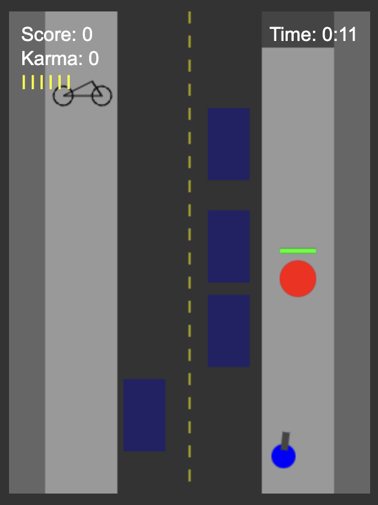
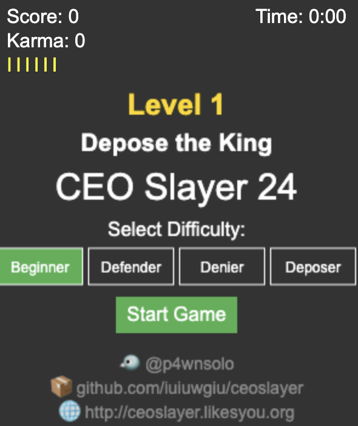
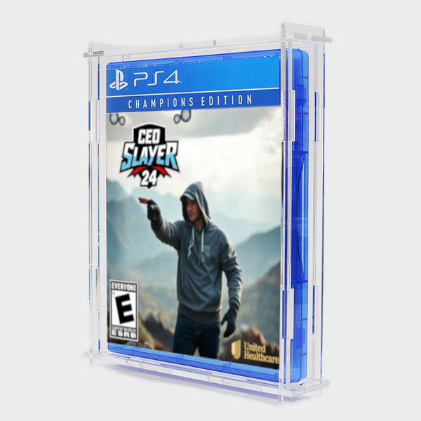

# CEO Slayer 24
**CEO Slayer 24** is a heart-pounding, claim-denying shooter game—not to be mistaken for GTA.

### Screenshot 1

*This is a gameplay screenshot.*

## Overview
This is an open-source project designed to serve as both a fun game and a boilerplate/template for bigger, better games. While the current version is simple, it's a great starting point for developers who want to improve it, create mods, or build entirely new levels.

### Current Version
**CEO Slayer v2.86** (first release!)

The entire game is contained in a single HTML file, making it easy to run and modify.

## Live Demo
Play the game here: [CEO Slayer Live Demo](http://ceoslayer.likesyou.org)

## Running the Game
There are multiple ways to run CEO Slayer:

1. **JSFiddle:** Copy the HTML file into the "HTML" section of [jsfiddle.net](https://jsfiddle.net) to run/test it.
2. **Webserver:** Upload the HTML file to a webserver. (Free hosting is available from [Infinity Free](https://www.infinityfree.net).)

## Contributions Welcome
I’ve put a lot of time into this game, but there’s plenty of room for improvement! Here’s how you can contribute:
- Enhance gameplay mechanics.
- Develop your own versions or mods.
- Create additional levels (e.g., Level 2 and beyond).

The game isn’t perfect—just like our healthcare system. Burn.

**Defend. Deny. Depose.**

## Project Links
- **GitHub:** [@p4wnsolo](https://github.com/p4wnsolo)
- **Twitter:** [@p4wnsolo](https://twitter.com/p4wnsolo)
- **(Related) MyCEO Project:** [myceo.lovestoblog.com](http://myceo.lovestoblog.com)

## Screenshots and Assets

### Screenshot 2

*Another gameplay screenshot.*

### PlayStation 4 Game Cover

*Mockup of the PlayStation 4 game cover.*

**Editable File:**
- `ceoslayer-ps4-game.xcf`: Open this in GIMP to edit the PS4 game cover.

### HD Cover Art

*High-definition cover art for the project.*

**Editable File:**
- `ceoslayer-24-cover-hd.xcf`: Open this in GIMP to edit the HD cover art.

---
Enjoy the game, and don’t forget to share your creations with the community!

Tools used:

- Claude.ai (Used this to generate the game code)
(Prompt: make a quick game i could run in a single-file jsfiddle. make the game where you're a guy on a city street - and theres a target animal on the sidewalk, and you need to shoot the target animal before it enters the building. make the game like zelda / gta 1 for pc (top down). keep it simple and guaranteed to work)
  
- https://deepai.org/machine-learning-model/text2img (Used this to generate the "shooter" game cover image)
(Prompt:  make a video game cover for a fictional video game called CEO Shooter where the hero is wearing a hoodie and pointing toward the distance)

- GIMP (used this to edit the images)

- https://getimg.ai/uncrop (Used this to "outpaint" the image given by deepAI's image generator)

- Free web hosting ("infinity free")
